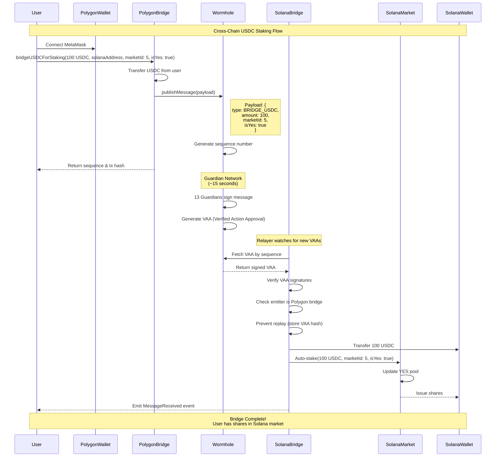
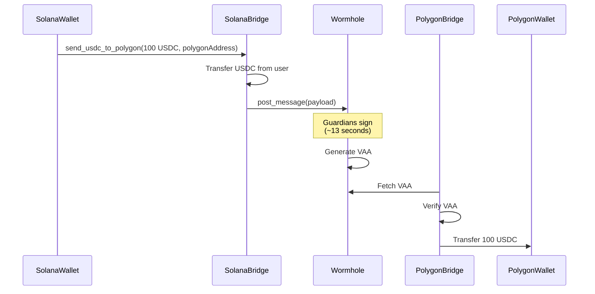

## Flow Explanation

### Step 1: User Initiates Bridge (Polygon)
```typescript
const tx = await bridgeUSDCPolygonToSolana({
  amount: '100',
  solanaRecipient: solanaWallet.publicKey.toBase58(),
  marketId: 5,
  isYes: true,
  signer: polygonSigner
})
```

### Step 2: Polygon Bridge Contract
```solidity
function bridgeUSDCForStaking(
    uint256 amount,
    bytes32 solanaRecipient,
    uint256 marketId,
    bool isYes
) external payable {
    // 1. Transfer USDC from user
    usdc.safeTransferFrom(msg.sender, address(this), amount);
    
    // 2. Encode payload
    bytes memory payload = abi.encode(
        MessageType.BRIDGE_USDC,
        msg.sender,
        amount,
        marketId,
        isYes,
        block.timestamp
    );
    
    // 3. Publish to Wormhole
    sequence = wormhole.publishMessage{value: msg.value}(
        nonce++,
        payload,
        15 // finality
    );
}
```

### Step 3: Wormhole Guardian Network
- 13 independent guardian nodes monitor Polygon
- Each guardian validates the transaction
- Guardians sign the message with their private keys
- Once 13/19 signatures collected → VAA is ready
- **Time**: ~15 seconds

### Step 4: VAA Retrieval
```typescript
// Frontend or relayer fetches VAA
const vaa = await getVAA(
  5, // Polygon chain ID
  polygonBridgeAddress,
  sequence
)
```

### Step 5: Solana Bridge Processing
```rust
pub fn receive_and_stake(
    ctx: Context<ReceiveAndStake>,
    vaa_hash: [u8; 32],
) -> Result<()> {
    let bridge = &mut ctx.accounts.bridge_state;
    
    // 1. Verify VAA
    let vaa = &ctx.accounts.vaa;
    require!(
        vaa.emitter_address() == bridge.polygon_emitter,
        BridgeError::InvalidEmitter
    );
    
    // 2. Check not already processed
    require!(
        !bridge.processed_vaas.contains(&vaa_hash),
        BridgeError::VAAAlreadyProcessed
    );
    
    // 3. Decode payload
    let message = BridgeMessage::try_from_slice(vaa.payload())?;
    
    // 4. Transfer USDC to user
    token::transfer(
        CpiContext::new(...),
        message.amount,
    )?;
    
    // 5. Auto-stake in market (if specified)
    if let Some(market_id) = message.market_id {
        // Call prediction market stake instruction
        invoke_stake(market_id, message.amount, message.is_yes)?;
    }
    
    // 6. Mark as processed
    bridge.processed_vaas.push(vaa_hash);
    
    Ok(())
}
```

### Step 6: Result
- ✅ User has USDC on Solana
- ✅ Automatically staked in market #5
- ✅ Received shares (YES position)
- ✅ Can claim winnings after market resolves

---

## Alternative Flow: Solana → Polygon



---

## Security Checkpoints

### ✅ Polygon Bridge
1. **ReentrancyGuard** - Prevents reentrancy attacks
2. **SafeERC20** - Safe token transfers
3. **Role-based access** - Admin/Relayer separation
4. **Pausable** - Emergency stop
5. **Fee validation** - Prevent insufficient fees

### ✅ Wormhole Guardians
1. **13/19 signatures required** - Decentralized consensus
2. **Independent validators** - No single point of failure
3. **Stake requirements** - Economic security
4. **Slashing** - Penalize malicious behavior

### ✅ Solana Bridge
1. **VAA verification** - Validates guardian signatures
2. **Emitter validation** - Only accepts from Polygon bridge
3. **Replay prevention** - Stores processed VAA hashes
4. **PDA security** - Proper account ownership
5. **Pausable** - Emergency stop

---

## Error Handling

### Insufficient Bridge Fee
```typescript
// Error: Insufficient bridge fee
// Solution: Increase msg.value
const tx = await bridge.bridgeUSDC(
  amount,
  recipient,
  { value: ethers.parseEther('0.02') } // Increase from 0.01
)
```

### VAA Not Available
```typescript
// Error: VAA not found after 30 attempts
// Reasons:
// 1. Transaction not finalized on source chain
// 2. Wormhole guardians offline
// 3. Wrong sequence number

// Solution: Wait longer or check transaction
const status = await getTransactionStatus(txHash)
```

### Invalid Emitter
```rust
// Error: InvalidEmitter
// Reason: Polygon bridge address not set correctly

// Solution: Re-initialize with correct address
anchor run initialize \
  --polygon-emitter CORRECT_ADDRESS \
  --provider.cluster devnet
```

---

## Monitoring & Alerts

### Track Bridge Volume
```typescript
// Listen to bridge events
bridge.on('USDCBridged', (sender, amount, recipient, sequence) => {
  console.log(`Bridge: ${amount} USDC from ${sender} to ${recipient}`)
  
  // Store in database
  await db.bridgeTransactions.create({
    sender,
    amount,
    recipient,
    sequence,
    timestamp: Date.now()
  })
  
  // Alert if large amount
  if (amount > ethers.parseUnits('10000', 6)) {
    await sendAlert(`Large bridge: ${amount} USDC`)
  }
})
```

### Monitor VAA Processing Time
```typescript
const start = Date.now()
const vaa = await getVAA(chainId, emitter, sequence)
const duration = Date.now() - start

if (duration > 60000) { // > 1 minute
  await sendAlert(`Slow VAA processing: ${duration}ms`)
}
```

---

## Cost Optimization

### Batch Bridging
Instead of bridging each stake individually, batch multiple stakes:

```typescript
// Inefficient: 3 separate bridges
await bridge.bridgeUSDC(100, recipient1)
await bridge.bridgeUSDC(100, recipient2)
await bridge.bridgeUSDC(100, recipient3)
// Cost: 3 × $0.011 = $0.033

// Efficient: 1 batch bridge
await bridge.bridgeUSDCBatch([
  { amount: 100, recipient: recipient1 },
  { amount: 100, recipient: recipient2 },
  { amount: 100, recipient: recipient3 },
])
// Cost: 1 × $0.011 = $0.011
```

### Relayer Gas Optimization
```typescript
// Use optimal gas price
const gasPrice = await getOptimalGasPrice()
const tx = await bridge.settlePosition(vaa, {
  gasPrice
})
```

---

This diagram and explanation show the complete end-to-end flow of bridging USDC from Polygon to Solana with auto-staking!
